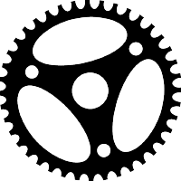

<!--
_class: lead invert
_footer: ""
_header: ""
_paginate: false
-->

# <!-- fit --> Informační systém pro správu<br>e-sportových turnajů
### Návrh a implementace backendu

<br>

Jan Najman

---

## Osnova

- Cíl práce
- Proč bylo zvoleno toto téma?
- Použité technologie
- Vývojové prostředí
- Implementace
    - Návh databáze
    - Zabezpečení
- Problémy

---

## Cíl práce

Cílem bakalářské práce je analýza vhodných technologií, návrh a implementace backendové části informačního systému pro správu e‑sportových turnajů.

---

## Proč bylo zvoleno toto téma?

- Nedostatek softwarových řešení
    - Jen některá jsou open-source
    - Málokterá obsahují chtěné funkce
- Technologická výzva
    - Nutnost použití různých technologií
- Pochopení rozsahu a obtížnosti realizace

---

## Použité technologie

  
  

---

## Vývojové prostředí

<br>

  

---

## Návh databáze

Konečný návrh má:
|||
|-:|:-|
15 | tabulek
8 | pohledů
6 | triggerů
11 | procedur
2 | funkce


---

## Stromové struktury v DB

Struktury jsou rozděleny na "označení" stromu a jeho uzly

---

### Označení stromů

Tabulka `bracket_trees`
- id
    - id stromu
- tournament_id
    - cizí klíč turnaje, ke kterému patří
- position
    - určuje pozici stromu v turnaji

---

### Uzly

Tabulka `brackets`
- bracket_tree_id
    - cizí klíč stromu, ve kterém se nachází
- layer
    - určuje, na které vrstvě se nachází
- position
    - určuje pozici ve vrstvě

---

### Výhody

- Není potřeba rekurzivní vyhledání

### Nevýhody

- Nutost ukládání přesné pozice uzlů
- Potřeba dvou tabulek
- Pouze předdefinovaný stom


---

## Zabezpečení

- JWT
- Role
- SQL Query Binding
- Hashování hesla


---

## JWT

- použit balík jsonwebtoken
- token je získán z headeru `AUTHORIZATION`
- implementovány metody
    - decode_jwt
        - extrakce dat a verifikace tokenu z headeru
    - encode_jwt
        - zakódování dat a přidání claims do tokenu

---

## SQL Query Binding

- použit balík sqlx
    - makra query_as a query

```rust
...
match query_as!(
    ReturningRow,
    "insert into games (name, description, version) values ($1, $2, $3) returning games.id",
    data.name,
    data.description,
    data.version
)
.fetch_one(pool.get_ref())
.await
{
...
```

---

## Hashování hesla

Implementovány metody:
- make_salt
    - vytváří 128 znaků dlouhoů sůl
    - každý znak může nabýt 71 hodnot
    - až $71^{128} \approx 9.1426\cdot10^{236}$ unikátních hodnot
- make_hash
    - použit balík argon2rs
- verify_password

---

## Problémy

- Reprezentace stromové struktury v databázy
- Algoritmus propagace výsledku turnaje
    - Nutnost propagace, jak ve stejném stromu, tak i propagace do dalsího stromu

---

<!--
_class: lead invert
_footer: ""
_header: ""
_paginate: false
-->

# Děkuji za pozornost
