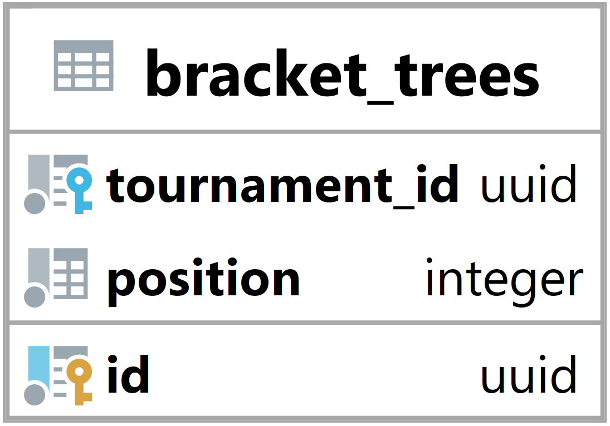

### Tabulka bracket_trees {#sec:table_bracket_trees}

Tabulka bracket_trees slouží k reprezentaci části stromové struktury v systému.
Jejím hlavním úkolem je umožnit backendu identifikovat k jakému stromu patří brackety a o jaký typ stromu se jedná.

{ height=10% }

Tournament_id vyjadřuje id navázaného turnaje ([@sec:table_tournaments]).

Position vyjadřuje pozici a vlastnosti stromu.
Pozice -1 říká, že se jedná o FFA strom.
Pozice 0 říká, že tento strom je na první pozici a určuje výherce turnaje.
Pozice 1 říká, že se jedná o první strom, kde jsou hráči co prohráli ve hlavním stromu na pozici 0.
Pozice 2 až n říká, že se jedná o n-1 strom, kde jsou hráči co prohráli ve stromu n-1.
Pozice 0 až n mohou určovat pouze jednoho výherce tohoto stromu, nebo mohou určovat výherce a prohraného.
Toto určování záleží na typu turnaje, více v sekci [-@sec:db_type_tournament_type].

Primární klíč id je primárně použit k identifikaci stromů a vázání bracketů stromy.
