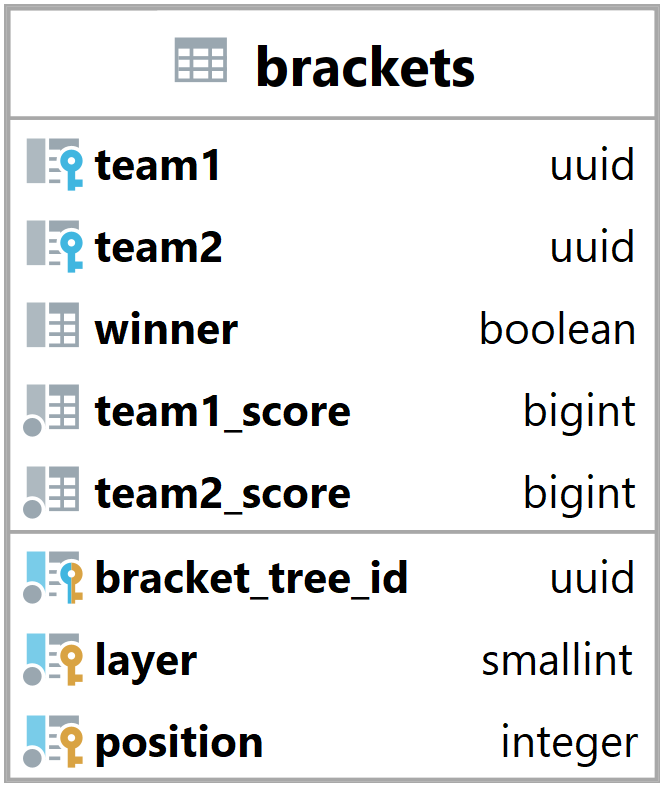

### Tabulka brackets {#sec:table_brackets}

Tabulka brackets slouží k reprezentaci části stromové struktury v systému.
Jejím hlavním úkolem je umožnit backendu získat data o průběhu turnaje nebo zápasu.

{ height=23% }

Team1 a team2 vyjadřují id navázaných týmu ([@sec:table_teams]).
Když je hodnota null tak ještě tým nepostoupil do tohoto bracketu.

Winner říká jaký tým vyhrál pokud je hodnota true tak vyhrál první tým,
pokud je hodnota false tak vyhrál druhý tým a pokud je hodnota null tak ještě nevyhrál žádný tým.

Team1_score a team2_score udává score kterého dosáhly týmy v zápasu.

Bracket_tree_id vyjadřuje id navázaného stromu ([@sec:table_bracket_trees]).

Layer a position udávají přesnou pozici bracketu ve stromu.
Layer neboli vrstva udává jak hluboko (na jaké vrstvě) se bracket nachází.
Position neboli pozice udává na jaké pozici ve vrstvě se bracket nachází.

Primární klíč je složen z bracket_tree_id, layer a position a zaručuje unikátnost bracketu ve stromě.
