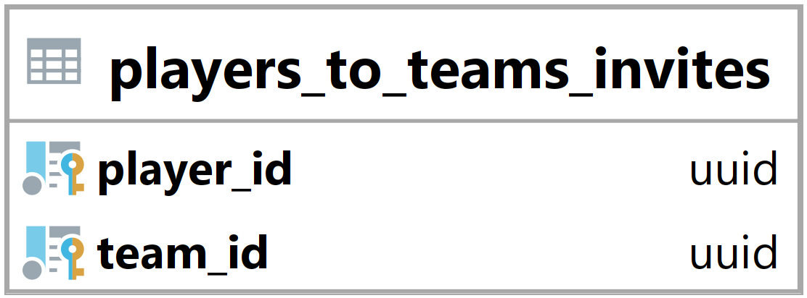

### Tabulka players_to_teams_invites {#sec:table_players_to_teams_invites}

Tabulka players_to_teams_invites slouží ke spojení uživatelů a týmů pro pozvánky.
Jejím hlavním úkolem je umožnit backendu zjistit jací uživatelé jsou pozvání do týmu jako hráči.
Tato tabulka obsahuje jen pozvánky, které ještě nebyly přijaty.

{ height=8.5% }

Team_id vyjadřuje id navázaného týmu ([@sec:table_teams]).

Player_id vyjadřuje id navázaného uživatele ([@sec:table_users]).

Primární klíč je složen z team_id a player_id.

