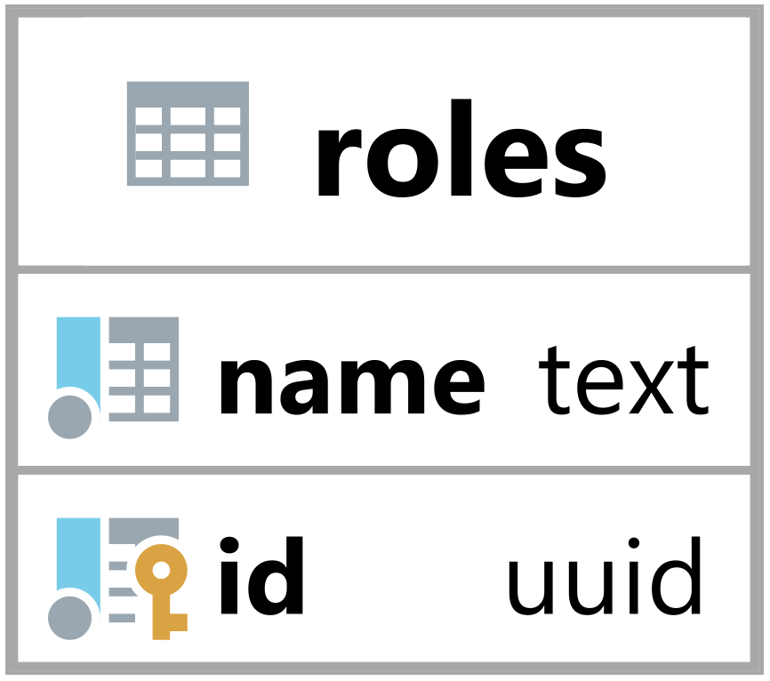

### Tabulka roles {#sec:table_roles}

Tabulka roles slouží k reprezentaci role uživatele v systém.
Jejím hlavním úkolem je umožnit backendu identifikovat typ role.

{ height=8.5% }

Sloupec name vyjadřuje název role a je dále používán v backendu ke kontrole oprávnění (TODO).

Primární klíč id je primárně použit k identifikaci a vázání role na ostatních tabulky.
