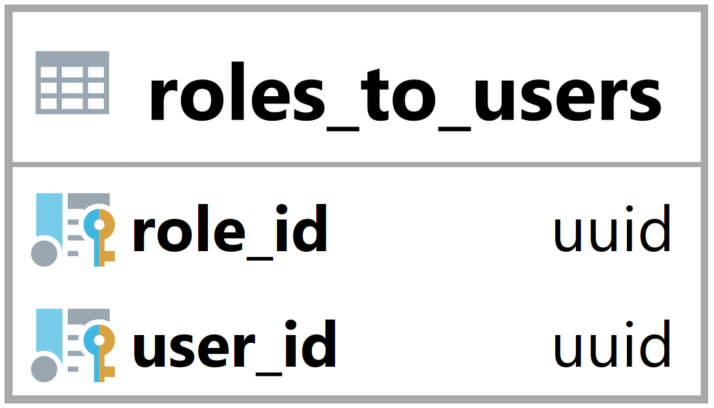

### Tabulka roles_to_users {#sec:table_roles_to_users}

Tabulka roles_to_users slouží ke spojení uživatele s rolemi.
Jejím hlavním úkolem je umožnit backendu zjistit jaké má uživatel role.

{ height=8.5% }

Role_id vyjadřuje id navázané role ([@sec:table_roles]).

User_id vyjadřuje id navázaného uživatele ([@sec:table_users]).

Primární klíč je složen z role_id a user_id.

