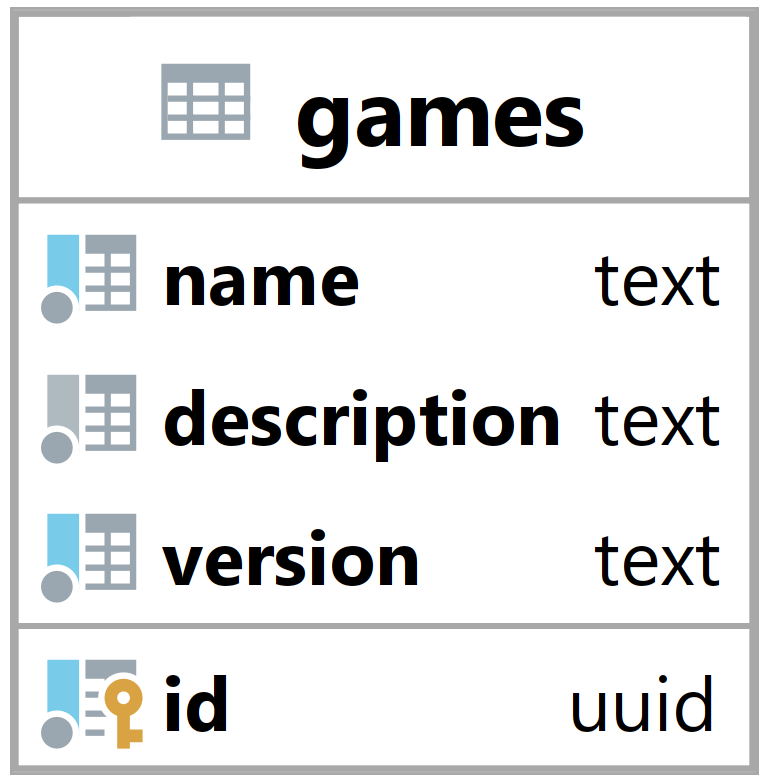

### Tabulka games {#sec:table_games}

Tabulka games slouží k reprezentaci hry v systém.
Jejím hlavním úkolem je umožnit backendu identifikovat hry a zjistit jejich vlastnosti.

{ height=12.5% }

Sloupec name slouží k identifikaci hry z pohledu uživatele a vyjadřuje název hry.

Description neboli popis slouží k popisu hry,
zde mohou organizátoři turnaje specifikovat detaily o dané hře.

Primární klíč id je primárně použit k identifikaci a vázání her na ostatních tabulky.
