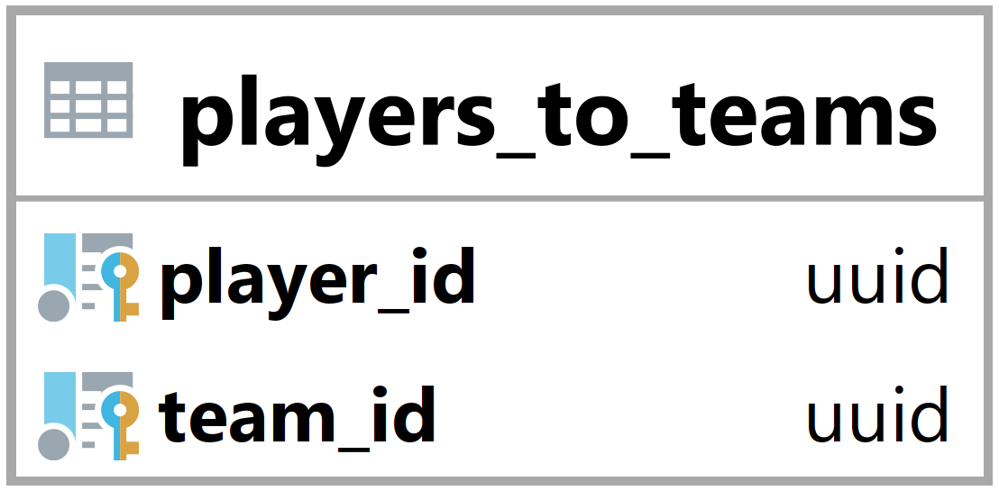

### Tabulka players_to_teams {#sec:table_players_to_teams}

Tabulka players_to_teams slouží ke spojení uživatelů a týmů.
Jejím hlavním úkolem je umožnit backendu zjistit, jací uživatelé jsou patří do daného týmu.
Tato tabulka obsahuje jen uživatelé, kteří již potvrdily pozvánku do týmu.

{ height=8.5% }

Team_id vyjadřuje id navázaného týmu ([@sec:table_teams]).

Player_id vyjadřuje id navázaného uživatele ([@sec:table_users]).

Primární klíč je složen z team_id a player_id.

