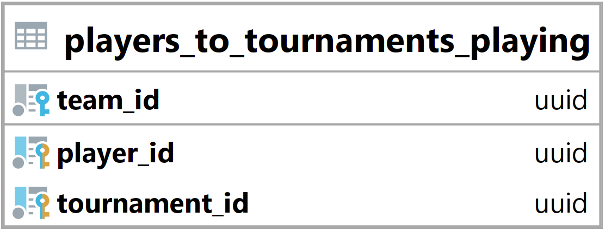

### Tabulka players_to_tournaments_playing {#sec:table_players_to_tournaments_playing}

Tabulka players_to_tournaments_playing slouží ke spojení uživatelů, týmů a turnajů.
Jejím hlavním úkolem je umožnit backendu zjistit, jací uživatelé hrají v jakých turnajích a za jaký tým.
Díky této tabulce se také jeden tým může účastnit více turnajů současně.

{ height=10% }

Team_id vyjadřuje id navázaného týmu ([@sec:table_teams]).

Player_id vyjadřuje id navázaného uživatele ([@sec:table_users]).

Tournament_id vyjadřuje id navázaného turnaje ([@sec:table_tournaments]).

Primární klíč je složen z tournament_id a player_id a zajišťuje, že uživatel může hrát v jednom turnaji jen za jeden tým.

