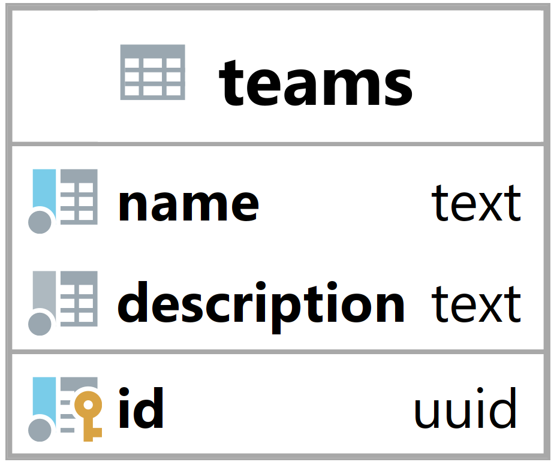

### Tabulka teams {#sec:table_teams}

Tabulka teams slouží k reprezentaci týmu v systému.
Jejím hlavním úkolem je umožnit backendu identifikovat týmy.

{ height=10% }

Sloupec name slouží k identifikaci týmu z pohledu uživatele.

Description neboli popis slouží k popisu týmu, zde mohou manažeři týmu uvádět detaily o jejich týmu.

Primární klíč id je primárně použit k identifikaci a vázání týmu na ostatních tabulky.
