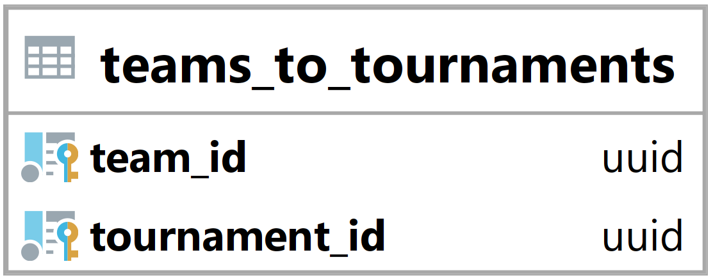

### Tabulka teams_to_tournaments {#sec:table_teams_to_tournaments}

Tabulka teams_to_tournaments slouží ke spojení týmů a turnajů.
Jejím hlavním úkolem je umožnit backendu zjistit, jaké týmy jsou přihlášeny na jaké turnaje.
Tato tabulka neobsahuje týmy, které teprve podaly přihlášku, ale ty které už mají potvrzenou účast.

{ height=8.5% }

Team_id vyjadřuje id navázaného týmu ([@sec:table_teams]).

Tournament_id vyjadřuje id navázaného turnaje ([@sec:table_tournaments]).

Primární klíč je složen z team_id a tournament_id.

