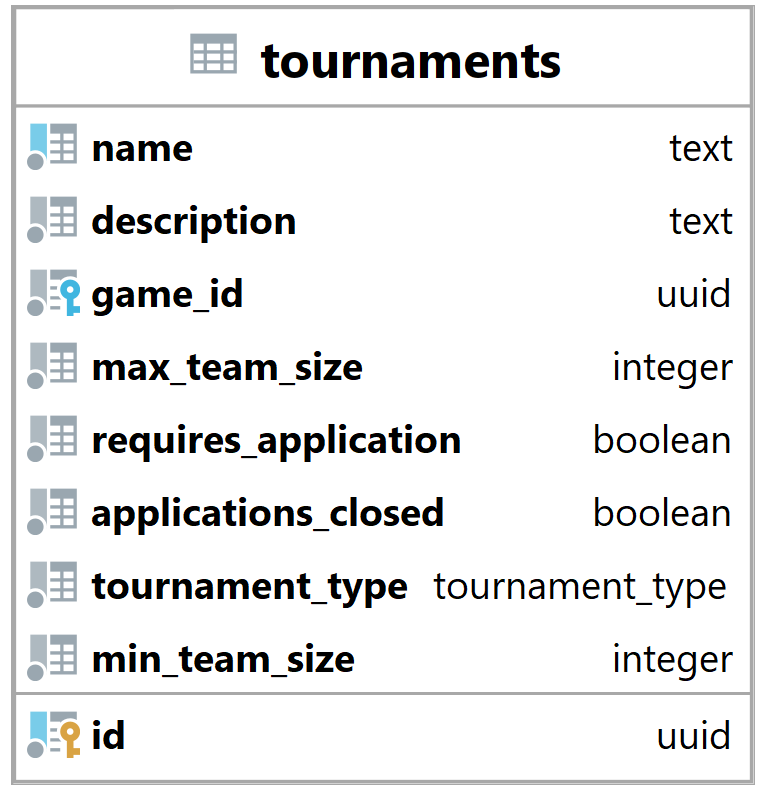

### Tabulka tournaments {#sec:table_tournaments}

Tabulka tournaments slouží k reprezentaci turnaje v systému.
Jejím hlavním úkolem je umožnit backendu identifikovat turnaje a zjistit jejich vlastnosti.

{ height=25% }

Sloupec name slouží k identifikaci turnaje z pohledu uživatele.

Description neboli popis slouží k popisu turnaje,
zde mohou organizátoři turnaje specifikovat detaily turnaje,
jako jsou pravidla turnaje.

Game_id slouží k navázaní hrané hry ([@sec:table_games]) k turnaji.

Max_team_size a min_team_size slouží k specifikaci velikosti týmu.

Requires_application označuje, zda turnaj vyžaduje podání přihlášky.
Pokud ano, tak se přihlášky budou nacházet v tabulce teams_to_tournaments_applications ([@sec:table_teams_to_tournaments_applications]),
a pokud ne, tak týmy, které se hlásí na tento turnaj, jsou automaticky přihlášeny
a přidány do tabulky teams_to_tournaments ([@sec:table_teams_to_tournaments]).
Tuto funkci obstarává procedura apply_for_tournament, více v sekci [-@sec:procedure_apply_for_tournament].

Applications_closed vyjadřuje zda jsou žádosti o přihlášení uzavřeny.

Tournament_type slouží k specifikaci typu turnaje, více v sekci [-@sec:db_type_tournament_type].

Primární klíč id je primárně použit k identifikaci a vázání turnajů na ostatní tabulky.

