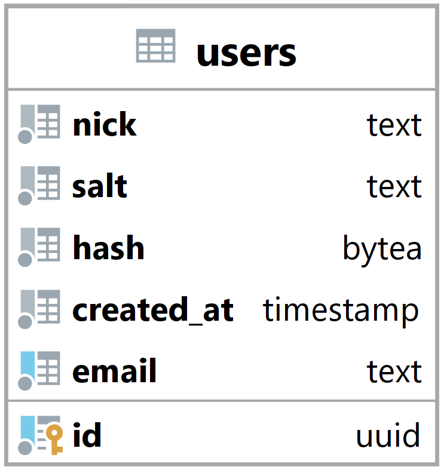

### Tabulka users {#sec:table_users}

Tabulka users reprezentuje uživatele v systém.
Termín uživatel v tomto kontextu může označovat organizátora turnaje, manažera týmu či hráče v týmu.

Jejím hlavním úkolem je umožnit backendu identifikovat uživatele a uživateli umožnit přihlášení.

{ height=17% }

Nick slouží jako přezdívka pro uživatele, tento termín je hlavně používán v herní komunitě.

Salt a hash jsou použity při ověřování uživatele při přihlášen.

Email je nejen použit při přihlašování, ale také při registraci.
Slouží jako unikátní identifikátor uživatele.

Primární klíč id je primárně použit k identifikaci a vázání uživatele na ostatních tabulky,
protože email je možné kdykoli změnit a také hlavně proto,
že email je soukromá informace a neměla by být sdílena s ostatními tabulkami.

