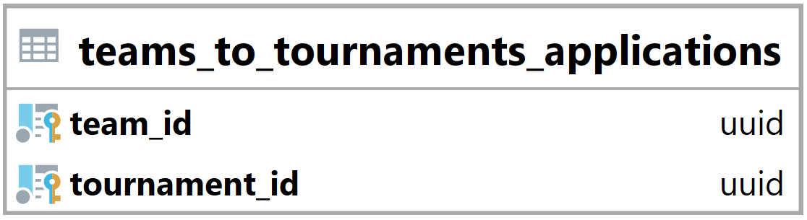

### Tabulka teams_to_tournaments_applications {#sec:table_teams_to_tournaments_applications}

Tabulka teams_to_tournaments_applications slouží ke spojení týmů a turnajů pro přihlášky.
Jejím hlavním úkolem je umožnit backendu zjistit jaké týmy podaly přihlášku na jaké turnaje.
Tato tabulka obsahuje týmy, které podaly přihlášku na turnaj, jež vyžaduje přihlášky,
a zároveň tato přihláška nesmí být potvrzena.

{ height=8.5% }

Team_id vyjadřuje id navázaného týmu ([@sec:table_teams]).

Tournament_id vyjadřuje id navázaného turnaje ([@sec:table_tournaments]).

Primární klíč je složen z team_id a tournament_id.

