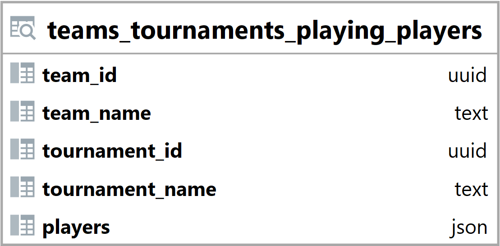

### Pohled teams_tournaments_playing_players {#sec:view_teams_tournaments_playing_players}

Pohled teams_tournaments_playing_players slouží ke přehlednějšímu zobrazení a jednoduššímu načtení dat.
Jeho hlavním úkolem je zobrazit jestli hráči v týmu hrají v daném turnaji nebo ne.
Tento pohled umožňuje jednoduché načtení a vyhledání dat backendem.

{ height=14% }

Sloupce team_id a team_name náleží příslušným sloupcům v tabulce teams ([@sec:table_teams]), bez prefixu team_.

Sloupce tournament_id a tournament_name náleží příslušným sloupcům v tabulce tournaments ([@sec:table_tournaments]), bez prefixu tournament_.

Sloupec players obsahuje pole s hráči ve formátu json.
Hráči dále obsahují informace jak o sobě, tak i o tom jestli hrají v turnaji za daný tým.

```{.json .linenos}
[{"player_id": "d685f026-f505-4e59-a927-e91f11f92cf0", "nick": "TEST :)", "playing": true},
 {"player_id": "264fb521-ba85-4572-931b-d22157b69b2d", "nick": "TEST 2", "playing": false}]
```

: Pohled teams_tournaments_playing_players ([@sec:view_teams_tournaments_playing_players]) - příklad hodnoty sloupce players {#lst:view_teams_tournaments_playing_players_players_example}

