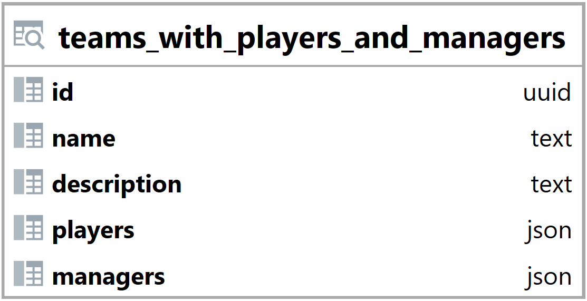

### Pohled teams_with_players_and_managers {#sec:view_teams_with_players_and_managers}

Pohled teams_with_players_and_managers slouží ke přehlednějšímu zobrazení a jednoduššímu načtení dat.
Jeho hlavním úkolem je zobrazit jací hráči a manažeři patří do týmu.
Tento pohled umožňuje jednoduché načtení a vyhledání dat backendem.

{ height=14% }

Id vyjadřuje id týmu ([@sec:table_teams]).

Name a description jsou brány z tabulky teams ([@sec:table_teams]).

Sloupec players obsahuje pole s hráči ve formátu json.

```{.json .linenos}
[{"id": "d685f026-f505-4e59-a927-e91f11f92cf0", "nick": "TEST :)"}, 
 {"id": "264fb521-ba85-4572-931b-d22157b69b2d", "nick": "TEST 2"}]
```

: Pohled teams_with_players_and_managers ([@sec:view_teams_with_players_and_managers]) - příklad hodnoty sloupce players {#lst:view_teams_with_players_and_managers_players_example}

Sloupec managers obsahuje pole s manažery ve formátu json.

```{.json .linenos}
[{"id": "83230549-e822-484f-91ce-b93dd789633c", "nick": "TEST 3"}]
```

: Pohled teams_with_players_and_managers ([@sec:view_teams_with_players_and_managers]) - příklad hodnoty sloupce managers {#lst:view_teams_with_players_and_managers_managers_example}

