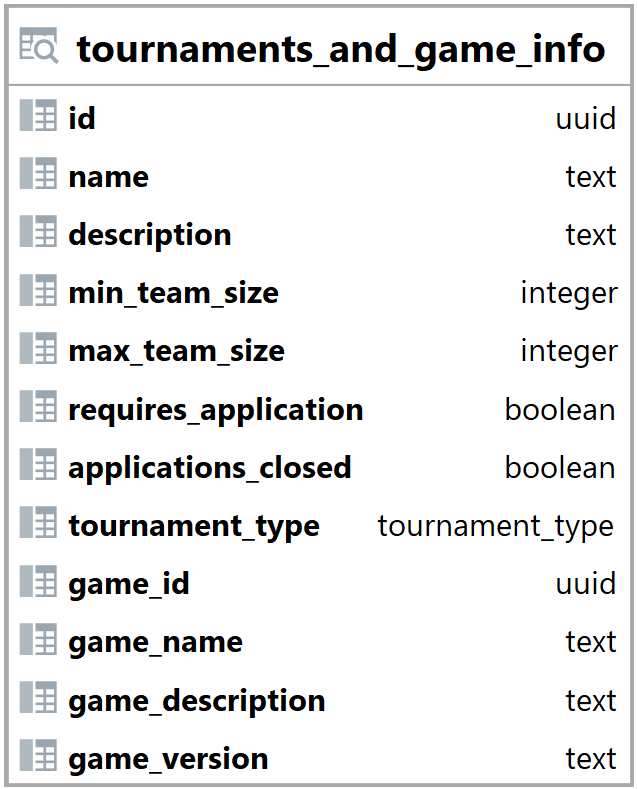

### Pohled tournaments_and_game_info {#sec:view_tournaments_and_game_info}

Pohled tournaments_and_game_info spojuje tabulku tournaments a games a vytváří tak novou tabulku.
Jeho hlavním úkolem je zobrazit turnaje a hranou hru.
Tento pohled umožňuje backendu jednoduše načíst a vyhledat data.

{ height=33% }

Sloupce id, name, description, min_team_size, max_team_size, requires_application, applications_closed a tournament_type jsou brány z tabulky tournaments ([@sec:table_tournaments]).

Sloupce game_id, game_name, game_description a game_version náleží příslušným sloupcům v tabulce games ([@sec:table_games]), bez prefixu game_.

