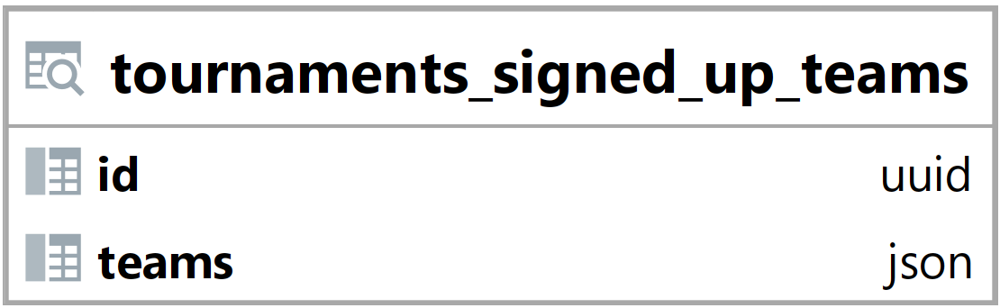

### Pohled tournaments_signed_up_teams {#sec:view_tournaments_signed_up_teams}

Pohled tournaments_signed_up_teams slouží k jednoduchému vyhledání a načtení dat.
Jeho hlavním úkolem je usnadnit vyhledání informací o týmech, které hrají v turnaji.
Tento pohled zjednodušuje načtení a vyhledání dat backendem.

{ height=8.5% }

Id vyjadřuje id turnaje ([@sec:table_tournaments]).

Sloupec teams obsahuje pole s týmy ve formátu json.
Týmy dále obsahují informace jak o sobě, tak i o tom, kolik hráčů v turnaji hraje,
a jestli je toto číslo v rozsahu pro validní velikost týmu.

```{.json .linenos}
[{"id": "ed20021d-571a-4d19-a4af-6e829df48e66", "name": "team12", "description": "team", "num_playing": 1, "valid_team_size": false},
 {"id": "9e6f1c54-202a-4f5e-8d3e-8f1a070c3866", "name": "team15", "description": "team", "num_playing": 4, "valid_team_size": true}]
```

: Pohled tournaments_signed_up_teams ([@sec:view_tournaments_signed_up_teams]) - příklad hodnoty sloupce teams {#lst:view_tournaments_signed_up_teams_teams_example}

