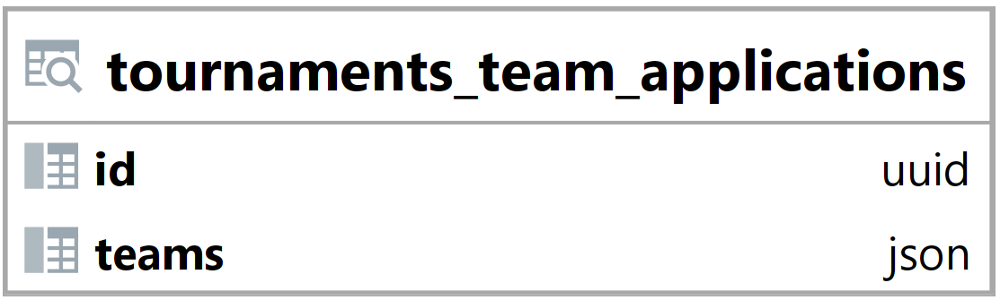

### Pohled tournaments_team_applications {#sec:view_tournaments_team_applications}

Pohled tournaments_team_applications slouží k jednoduchému vyhledání a načtení dat.
Jeho hlavním úkolem je usnadnit vyhledání informací o týmech, které podaly přihlášku na turnaj.
Tento pohled zjednodušuje načtení a vyhledání dat backendem.

{ height=8.5% }

Id vyjadřuje id turnaje ([@sec:table_tournaments]).

Sloupec teams obsahuje pole s týmy ve formátu json.

```{.json .linenos}
[{"id": "ed20021d-571a-4d19-a4af-6e829df48e66", "name": "team12", "description": "team"},
 {"id": "9e6f1c54-202a-4f5e-8d3e-8f1a070c3866", "name": "team15", "description": "team"}]
```

: Pohled tournaments_team_applications ([@sec:view_tournaments_team_applications]) - příklad hodnoty sloupce teams {#lst:view_tournaments_team_applications_teams_example}

