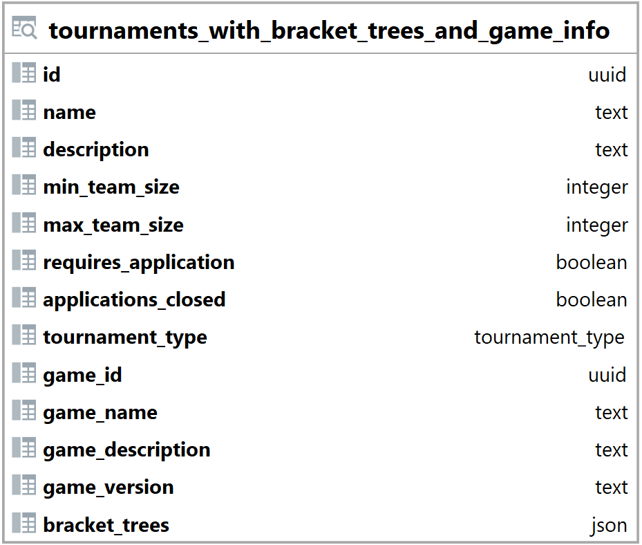

### Pohled tournaments_with_bracket_trees_and_game_info {#sec:view_tournaments_with_bracket_trees_and_game_info}

Pohled tournaments_with_bracket_trees_and_game_info shromažďuje informace z tabulek tournaments, games, bracket_trees a brackets.
Jeho hlavním úkolem je zobrazit informace o turnaji, hrané hře a stromech zápasů.
Tento pohled backendu výrazně zjednodušuje získávání a načítání dat o stromech zápasů.

{ height=36% }

Sloupce id, name, description, min_team_size, max_team_size, requires_application, applications_closed a tournament_type jsou brány z tabulky tournaments ([@sec:table_tournaments]).

Sloupce game_id, game_name, game_description a game_version náleží příslušným sloupcům v tabulce games ([@sec:table_games]), bez prefixu game_.

Sloupec bracket_trees obsahuje pole se stromy.

```{.json .linenos}
[
  { // second bracket tree (1st losers tree)
    "id": "7951a202-0539-4e86-b5bb-ae6151606859",
    "position": 1,
    // brackets inside the tree
    "brackets": [
      { // bracket information
        "team1": {"id": "a65c56d4-6936-4b8b-ab07-1dca471ad8d4", "name": "team6"},
        "team2": {"id": "b5f99b63-45cc-455f-b3fe-c56907c2893a", "name": "team7"},
        "winner": null,
        "layer": 0,
        "team1_score": 0,
        "team2_score": 0,
        "position": 0
      }
    ]
  }
]
```

: Pohled tournaments_with_bracket_trees_and_game_info ([@sec:view_tournaments_with_bracket_trees_and_game_info ]) - příklad hodnoty sloupce bracket_trees {#lst:view_tournaments_with_bracket_trees_and_game_info_bracket_trees_example}

