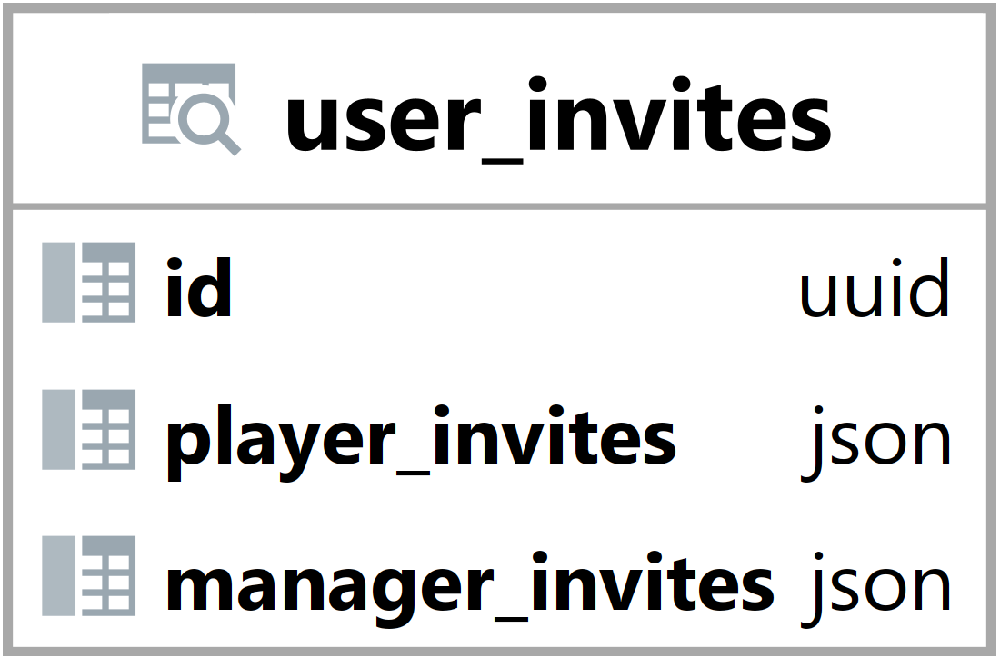

### Pohled user_invites {#sec:view_user_invites}

Pohled user_invites slouží ke přehlednějšímu zobrazení a jednoduššímu načtení dat.
Jeho hlavním úkolem je zobrazit do jakých týmů byl uživatele pozván, buď jako hráč nebo manažer.
Tento pohled umožňuje jednoduché načtení a vyhledání dat backendem.

{ height=10% }

Id vyjadřuje id uživatele ([@sec:table_users]).

Sloupec player_invites obsahuje pole s týmy ve formátu json.

```{.json .linenos}
[{"id": "58e99ccc-0bd8-4b42-98b7-843f4879f91d", "name": "test-team"},
 {"id": "c299cb77-8394-4842-b362-f15a4ae11e33", "name": "test-team2"}]
```

: Pohled user_invites ([@sec:view_user_invites]) - příklad hodnoty sloupce player_invites {#lst:view_user_invites_player_invites_example}

Sloupec managers obsahuje pole s týmy ve formátu json.

```{.json .linenos}
[{"id": "58e99ccc-0bd8-4b42-98b7-843f4879f91d", "name": "test-team"}]
```

: Pohled user_invites ([@sec:view_user_invites]) - příklad hodnoty sloupce manager_invites {#lst:view_user_invites_manager_invites_example}

