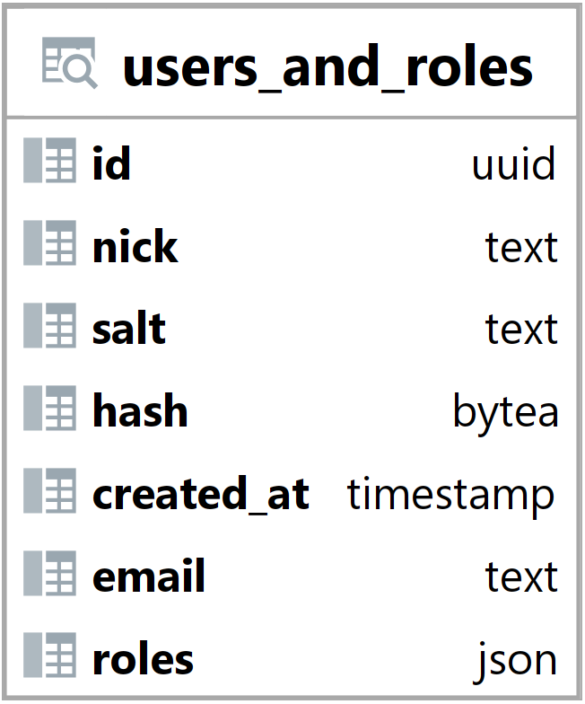

### Pohled users_and_roles {#sec:view_users_and_roles}

Pohled users_and_roles spojuje tabulku users a roles a vytváří tak novou tabulku.
Jeho hlavním úkolem je zobrazit jaké role uživatel má.
Tento pohled umožňuje backendu jednoduše načíst a vyhledat jaké role uživatel má.

{ height=20% }

Sloupce id, nick, salt, crated_at a email jsou brány z tabulky users ([@sec:table_users]).

Sloupec roles obsahuje pole s rolemi uživatele ve formátu json.

```{.json .linenos}
["Tournament Manager"]
```

: Pohled users_and_roles ([@sec:view_users_and_roles]) - příklad hodnoty sloupce roles {#lst:view_users_and_roles_roles_example}
