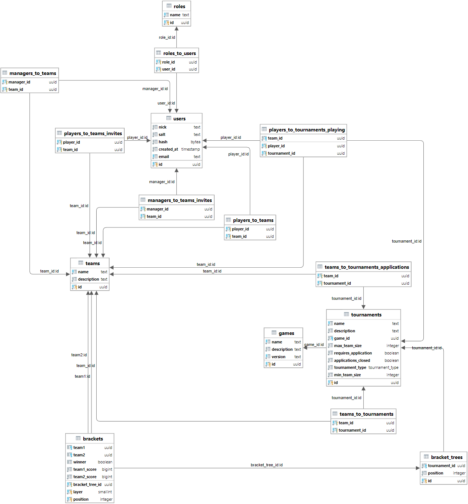

\hyphenpenalty=10000
\widowpenalties 1 10000
\raggedbottom

``` {.include}
chapters/abstract.md
```

<!-- Table of contents -->
\toc
\newpage

<!-- Set page style -->
\pagestyle{plain}
\parindent 1,25cm
\parskip 12pt
\setcounter{page}{1}

``` {.include}
chapters/uvod.md
chapters/teoreticka_cast.md
chapters/analyza_pozadavku.md
chapters/navrh_backendu/navrh_backendu.md
chapters/implementace/implementace.md
chapters/zaver.md
```

# Seznam použité literatury

::: {#refs}
:::

\newpage

# Seznam obrázků, tabulek a kódů

\lof
\lot
\lol

\newpage

\pagestyle{empty}

# Přílohy

{#fig:database_table_diagram}

\blandscape

| Feature | [actix](https://actix.rs/) (4.4) | [axum](https://github.com/tokio-rs/axum) (0.6) | [rocket](https://rocket.rs/) (0.5.0) | [express](https://expressjs.com/) (4.18) | [fastapi](https://fastapi.tiangolo.com/) (0.104) | [basicphp](https://github.com/ray-ang/basicphp) (0.9) | [flask](https://www.palletsprojects.com/p/flask/) (3) | [django](https://djangoproject.com/) (4.2) |
|------------|:---:|:---:|:---:|:---:|:---:|:---:|:---:|:---:|
Type-safe information extraction | \emoji{✅} | \emoji{✅} | \emoji{✅} | \emoji{❌} | \emoji{❌} | \emoji{❌} | \emoji{❌} | \emoji{❌} |
Shared mutable state             | \emoji{✅} | \emoji{✅} | \emoji{✅} | \emoji{✅} | \emoji{✅} | \emoji{✅} | \emoji{✅} | \emoji{✅} |
Scopes                           | \emoji{✅} | \emoji{❌} | \emoji{❌} | \emoji{❌} | \emoji{❌} | \emoji{❌} | \emoji{❌} | \emoji{❌} |
Guards                           | \emoji{✅} | \emoji{❌} | \emoji{❌} | \emoji{❌} | \emoji{❌} | \emoji{❌} | \emoji{❌} | \emoji{❌} |
Multi-Threading                  | \emoji{✅} | \emoji{✅} | \emoji{✅} | \emoji{❌} | \emoji{❌} | \emoji{❌} | \emoji{✅} | \emoji{✅} |
TLS / HTTPS                      | \emoji{✅} | \emoji{✅} | \emoji{✅} | \emoji{✅} | \emoji{✅} | \emoji{✅} | \emoji{✅} | \emoji{❌} |
Keep-Alive                       | \emoji{✅} | \emoji{✅} | \emoji{✅} | \emoji{✅} | \emoji{✅} | \emoji{❌} | \emoji{❌} | \emoji{❌} |
Graceful shutdown                | \emoji{✅} | \emoji{✅} | \emoji{✅} | \emoji{✅} | \emoji{✅} | \emoji{❌} | \emoji{✅} | \emoji{❌} |
Streaming response body          | \emoji{✅} | \emoji{✅} | \emoji{✅} | \emoji{✅} | \emoji{✅} | \emoji{✅} | \emoji{✅} | \emoji{✅} |
Configurable logging             | \emoji{✅} | \emoji{✅} | \emoji{❌} | \emoji{❌} | \emoji{❌} | \emoji{❌} | \emoji{❌} | \emoji{✅} |
Path normalization               | \emoji{✅} | \emoji{✅} | \emoji{✅} | \emoji{❌} | \emoji{❌} | \emoji{❌} | \emoji{❌} | \emoji{❌} |
Default response configuration   | \emoji{✅} | \emoji{✅} | \emoji{✅} | \emoji{❌} | \emoji{✅} | \emoji{❌} | \emoji{❌} | \emoji{❌} |
Multipart body                   | \emoji{✅} | \emoji{✅} | \emoji{✅} | \emoji{❌} | \emoji{❌} | \emoji{✅} | \emoji{❌} | \emoji{✅} |
Urlencoded body                  | \emoji{✅} | \emoji{✅} | \emoji{✅} | \emoji{✅} | \emoji{❌} | \emoji{✅} | \emoji{✅} | \emoji{✅} |
Compression                      | \emoji{✅} | \emoji{✅} | \emoji{✅} | \emoji{❌} | \emoji{✅} | \emoji{❌} | \emoji{❌} | \emoji{❌} |
Integrated unit testing          | \emoji{✅} | \emoji{✅} | \emoji{✅} | \emoji{❌} | \emoji{❌} | \emoji{❌} | \emoji{❌} | \emoji{✅} |
Middleware                       | \emoji{✅} | \emoji{✅} | \emoji{✅} | \emoji{✅} | \emoji{✅} | \emoji{❌} | \emoji{✅} | \emoji{✅} |
Built-in session management      | \emoji{❌} | \emoji{❌} | \emoji{❌} | \emoji{❌} | \emoji{❌} | \emoji{✅} | \emoji{✅} | \emoji{✅} |
Error handlers                   | \emoji{✅} | \emoji{✅} | \emoji{✅} | \emoji{✅} | \emoji{✅} | \emoji{❌} | \emoji{✅} | \emoji{❌} |
Static files                     | \emoji{✅} | \emoji{✅} | \emoji{✅} | \emoji{✅} | \emoji{✅} | \emoji{✅} | \emoji{✅} | \emoji{✅} |
Websockets                       | \emoji{✅} | \emoji{✅} | \emoji{✅} | \emoji{❌} | \emoji{✅} | \emoji{❌} | \emoji{❌} | \emoji{❌} |

: Porovnání funkcí frameworků {#tbl:framework_features_comparison}

\newpage

| Jazyk | Framework | Dotazy za sekundu (64) | Dotazy za sukundu (256) | Dotazy za sukundu (512) | Rozdíl oproti prvnímu (512) |
| :---|:---|---:|---:|---:|---: |
rust (1.73) | [actix](https://actix.rs/) (4.4) | 182 895 | 194 120 | 194 502 | 0.00%
rust (1.73) | [axum](https://github.com/tokio-rs/axum) (0.6) | 146 270 | 168 330 | 173 889 | 11.19%
rust (1.73) | [rocket](https://rocket.rs/) (0.5.0) | 97 071 | 107 490 | 109 007 | 56.34%
javascript (ES2019) | [express](https://expressjs.com/) (4.18) | 24 779 | 24 305 | 23 616 | 156.69%
python (3.12) | [fastapi](https://fastapi.tiangolo.com/) (0.104) | 17 963 | 18 339 | 18 227 | 165.73%
php (8.2) | [basicphp](https://github.com/ray-ang/basicphp) (0.9) | 16 652 | 16 305 | 15 977 | 169.64%
python (3.12) | [flask](https://www.palletsprojects.com/p/flask/) (3) | 2 787 | 2 545 | 2 242 | 195.44%
python (3.12) | [django](https://djangoproject.com/) (4.2) | 1 739 | 1 912 | 1 754 | 196.43%

: Porovnání frameworků - dotazy za sekundu [@web_frameworks_benchmark_tables] {#tbl:framework_comparison_requests_per_second_table}

\newpage

```{.plotly_python #fig:framework_comparison_requests_per_second_graph caption="Porovnání frameworků - dotazy za sekundu [@web_frameworks_benchmark_graphs]"}
import plotly.graph_objects as go

x_label=['Concurency 64', 'Concurency 256', 'Concurency 512']

fig = go.Figure(data=[
    go.Bar(name='actix (4.4)', x=x_label, y=[182895, 194120, 194502], text=[182895, 194120, 194502]),
    go.Bar(name='axum (0.6)', x=x_label, y=[146270, 168330, 173889], text=[146270, 168330, 173889]),
    go.Bar(name='rocket (0.5.0)', x=x_label, y=[97071, 107490, 109007], text=[97071, 107490, 109007]),
    go.Bar(name='express (4.18)', x=x_label, y=[24779, 24305, 23616], text=[24779, 24305, 23616]),
    go.Bar(name='fastapi (0.104)', x=x_label, y=[17963, 18339, 18227], text=[17963, 18339, 18227]),
    go.Bar(name='basicphp (0.9)', x=x_label, y=[16652, 16305, 15977], text=[16652, 16305, 15977]),
    go.Bar(name='flask (3)', x=x_label, y=[2787, 2545, 2242], text=[2787, 2545, 2242]),
    go.Bar(name='django (4.2)', x=x_label, y=[1739, 1912, 1754], text=[1739, 1912, 1754])
])
fig.update_yaxes(
    tickmode='linear',
    tick0=0,
    dtick=20000,
    showline=True,
    linewidth=2,
    linecolor='rgba(38,38,38,0.25)',
    gridcolor='rgba(38,38,38,0.15)'
)
fig.update_xaxes(
    showline=True,
    linewidth=2,
    linecolor='rgba(38,38,38,0.25)'
)
fig.update_traces(
    texttemplate='%{text:.2s}',
    textfont_size=22,
    textposition='outside'
)
fig.update_layout(
    font_size=24,
    bargroupgap=0.2,
    barmode='group',
    legend=dict(
        orientation='h',
        yanchor='bottom',
        y=1.0,
        xanchor='center',
        x=0.5
    ),
    margin=dict(l=0, r=0, t=0, b=0),
    paper_bgcolor='rgba(0,0,0,0)',
    plot_bgcolor='rgba(0,0,0,0)',
    width=2000,
    height=1000
)
```

\newpage

| Jazyk | Framework | Průměrná latence (64) | Průměrná latence (256) | Průměrná latence (512) | Rozdíl oproti prvnímu (512) |
| :---|:---|---:|---:|---:|---: |
rust (1.73) | [actix](https://actix.rs/) (4.4) | 0.31ms | 1.23ms | 2.22ms | 0.00ms
rust (1.73) | [axum](https://github.com/tokio-rs/axum) (0.6) | 0.43ms | 1.45ms | 2.71ms | 0.49ms
rust (1.73) | [rocket](https://rocket.rs/) (0.5.0) | 0.66ms | 2.26ms | 4.43ms | 2.21ms
javascript (ES2019) | [express](https://expressjs.com/) (4.18) | 2.83ms | 10.69ms | 23.34ms | 21.12ms
python (3.12) | [fastapi](https://fastapi.tiangolo.com/) (0.104) | 3.58ms | 14.05ms | 29.13ms | 26.91ms
php (8.2) | [basicphp](https://github.com/ray-ang/basicphp) (0.9) | 3.87ms | 15.66ms | 31.92ms | 29.70ms
python (3.12) | [flask](https://www.palletsprojects.com/p/flask/) (3) | 13.34ms | 69.47ms | 151.26ms | 149.04ms
python (3.12) | [django](https://djangoproject.com/) (4.2) | 18.83ms | 85.75ms | 179.82ms | 177.60ms

: Porovnání frameworků - průměrná latence [@web_frameworks_benchmark_tables] {#tbl:framework_comparison_average_latency_table}

\newpage

```{.plotly_python #fig:framework_comparison_average_latency_graph caption="Porovnání frameworků - průměrná latence [@web_frameworks_benchmark_graphs]"}
import plotly.graph_objects as go

x_label=['Concurency 64', 'Concurency 256', 'Concurency 512']

fig = go.Figure(data=[
    go.Bar(name='actix (4.4)', x=x_label, y=[0.31, 1.23, 2.22], text=['0.31ms', '1.23ms', '2.22ms']),
    go.Bar(name='axum (0.6)', x=x_label, y=[0.43, 1.45, 2.71], text=['0.43ms', '1.45ms', '2.71ms']),
    go.Bar(name='rocket (0.5.0)', x=x_label, y=[0.66, 2.26, 4.43], text=['0.66ms', '2.26ms', '4.43ms']),
    go.Bar(name='express (4.18)', x=x_label, y=[2.83, 10.69, 23.34], text=['2.83ms', '10.69ms', '23.34ms']),
    go.Bar(name='fastapi (0.104)', x=x_label, y=[3.58, 14.05, 29.13], text=['3.58ms', '14.05ms', '29.13ms']),
    go.Bar(name='basicphp (0.9)', x=x_label, y=[3.87, 15.66, 31.92], text=['3.87ms', '15.66ms', '31.92ms']),
    go.Bar(name='flask (3)', x=x_label, y=[13.34, 69.47, 151.26], text=['13.34ms', '69.47ms', '151.26ms']),
    go.Bar(name='django (4.2)', x=x_label, y=[18.83, 85.75, 179.82], text=['18.83ms', '85.75ms', '179.82ms'])
])
fig.update_yaxes(
    tickmode='linear',
    tick0=0,
    dtick=20,
    ticksuffix='ms',
    range=[0, 210],
    showline=True,
    linewidth=2,
    linecolor='rgba(38,38,38,0.25)',
    gridcolor='rgba(38,38,38,0.15)'
)
fig.update_xaxes(
    showline=True,
    linewidth=2,
    linecolor='rgba(38,38,38,0.25)'
)
fig.update_traces(
    textangle=90,
    constraintext='inside',
    textfont_size=22,
    textposition='outside'
)
fig.update_layout(
    font_size=24,
    bargroupgap=0.2,
    barmode='group',
    legend=dict(
        orientation='h',
        yanchor='bottom',
        y=1.0,
        xanchor='center',
        x=0.5
    ),
    margin=dict(l=0, r=0, t=0, b=0),
    paper_bgcolor='rgba(0,0,0,0)',
    plot_bgcolor='rgba(0,0,0,0)',
    width=2000,
    height=1000
)
```

\newpage

| Jazyk | Framework | P99 latence (64) | P99 latence (256) | P99 latence (512) | Rozdíl oproti prvnímu (512) |
| :---|:---|---:|---:|---:|---: |
rust (1.73) | [actix](https://actix.rs/) (4.4) | 0.86ms | 5.32ms | 5.52ms | 0.00ms
rust (1.73) | [axum](https://github.com/tokio-rs/axum) (0.6) | 1.32ms | 4.92ms | 7.70ms | 2.18ms
rust (1.73) | [rocket](https://rocket.rs/) (0.5.0) | 2.35ms | 5.78ms | 10.37ms | 4.85ms
php (8.2) | [basicphp](https://github.com/ray-ang/basicphp) (0.9) | 8.37ms | 25.55ms | 48.70ms | 43.18ms
javascript (ES2019) | [express](https://expressjs.com/) (4.18) | 14.56ms | 26.85ms | 56.82ms | 51.30ms
python (3.12) | [fastapi](https://fastapi.tiangolo.com/) (0.104) | 8.36ms | 28.33ms | 57.22ms | 51.70ms
python (3.12) | [flask](https://www.palletsprojects.com/p/flask/) (3) | 38.56ms | 160.44ms | 348.59ms | 343.07ms
python (3.12) | [django](https://djangoproject.com/) (4.2) | 44.84ms | 187.65ms | 389.59ms | 384.07ms

: Porovnání frameworků - P99 latence [@web_frameworks_benchmark_tables] {#tbl:framework_comparison_p99_latency_table}

\newpage

```{.plotly_python #fig:framework_comparison_p99_latency_graph caption="Porovnání frameworků - P99 latence [@web_frameworks_benchmark_graphs]"}
import plotly.graph_objects as go

x_label=['Concurency 64', 'Concurency 256', 'Concurency 512']

fig = go.Figure(data=[
    go.Bar(name='actix (4.4)', x=x_label, y=[0.86, 5.32, 5.52], text=['0.86ms', '5.32ms', '5.52ms']),
    go.Bar(name='axum (0.6)', x=x_label, y=[1.32, 4.92, 7.70], text=['1.32ms', '4.92ms', '7.70ms']),
    go.Bar(name='rocket (0.5.0)', x=x_label, y=[2.35, 5.78, 10.37], text=['2.35ms', '5.78ms', '10.37ms']),
    go.Bar(name='basicphp (0.9)', x=x_label, y=[8.37, 25.55, 48.70], text=['8.37ms', '25.55ms', '48.70ms']),
    go.Bar(name='express (4.18)', x=x_label, y=[14.56, 26.85, 56.82], text=['14.56ms', '26.85ms', '56.82ms']),
    go.Bar(name='fastapi (0.104)', x=x_label, y=[8.36, 28.33, 57.22], text=['8.36ms', '28.33ms', '57.22ms']),
    go.Bar(name='flask (3)', x=x_label, y=[38.56, 160.44, 348.59], text=['38.56ms', '160.44ms', '348.59ms']),
    go.Bar(name='django (4.2)', x=x_label, y=[44.84, 187.65, 389.59], text=['44.84ms', '187.65ms', '389.59ms'])
])
fig.update_yaxes(
    tickmode='linear',
    tick0=0,
    dtick=40,
    ticksuffix='ms',
    range=[0, 460],
    showline=True,
    linewidth=2,
    linecolor='rgba(38,38,38,0.25)',
    gridcolor='rgba(38,38,38,0.15)'
)
fig.update_xaxes(
    showline=True,
    linewidth=2,
    linecolor='rgba(38,38,38,0.25)'
)
fig.update_traces(
    textangle=90,
    constraintext='inside',
    textfont_size=22,
    textposition='outside'
)
fig.update_layout(
    font_size=24,
    bargroupgap=0.2,
    barmode='group',
    legend=dict(
        orientation='h',
        yanchor='bottom',
        y=1.0,
        xanchor='center',
        x=0.5
    ),
    margin=dict(l=0, r=0, t=0, b=0),
    paper_bgcolor='rgba(0,0,0,0)',
    plot_bgcolor='rgba(0,0,0,0)',
    width=2000,
    height=1000
)
```

\newpage

| Jazyk | Framework | P90 latence (64) | P90 latence (256) | P90 latence (512) | Rozdíl oproti prvnímu (512) |
| :---|:---|---:|---:|---:|---: |
rust (1.73) | [actix](https://actix.rs/) (4.4) | 0.43ms | 1.83ms | 2.85ms | 0.00ms
rust (1.73) | [axum](https://github.com/tokio-rs/axum) (0.6) | 0.74ms | 2.55ms | 5.21ms | 2.36ms
rust (1.73) | [rocket](https://rocket.rs/) (0.5.0) | 1.17ms | 4.14ms | 7.06ms | 4.21ms
javascript (ES2019) | [express](https://expressjs.com/) (4.18) | 3.68ms | 13.73ms | 27.14ms | 24.29ms
python (3.12) | [fastapi](https://fastapi.tiangolo.com/) (0.104) | 5.45ms | 17.71ms | 33.95ms | 31.10ms
php (8.2) | [basicphp](https://github.com/ray-ang/basicphp) (0.9) | 5.97ms | 20.12ms | 38.33ms | 35.48ms
python (3.12) | [flask](https://www.palletsprojects.com/p/flask/) (3) | 27.13ms | 124.75ms | 275.51ms | 272.66ms
python (3.12) | [django](https://djangoproject.com/) (4.2) | 35.15ms | 147.72ms | 322.86ms | 320.01ms

: Porovnání frameworků - P90 latence [@web_frameworks_benchmark_tables] {#tbl:framework_comparison_p90_latency_table}

\newpage


```{.plotly_python #fig:framework_comparison_p90_latency_graph caption="Porovnání frameworků - P90 latence [@web_frameworks_benchmark_graphs]"}
import plotly.graph_objects as go

x_label=['Concurency 64', 'Concurency 256', 'Concurency 512']

fig = go.Figure(data=[
    go.Bar(name='actix (4.4)', x=x_label, y=[0.43, 1.83, 2.85], text=['0.43ms', '1.83ms', '2.85ms']),
    go.Bar(name='axum (0.6)', x=x_label, y=[0.74, 2.55, 5.21], text=['0.74ms', '2.55ms', '5.21ms']),
    go.Bar(name='rocket (0.5.0)', x=x_label, y=[1.17, 4.14, 7.06], text=['1.17ms', '4.14ms', '7.06ms']),
    go.Bar(name='express (4.18)', x=x_label, y=[3.68, 13.73, 27.14], text=['3.68ms', '13.73ms', '27.14ms']),
    go.Bar(name='fastapi (0.104)', x=x_label, y=[5.45, 17.71, 33.95], text=['5.45ms', '17.71ms', '33.95ms']),
    go.Bar(name='basicphp (0.9)', x=x_label, y=[5.97, 20.12, 38.33], text=['5.97ms', '20.12ms', '38.33ms']),
    go.Bar(name='flask (3)', x=x_label, y=[27.13, 124.75, 275.51], text=['27.13ms', '124.75ms', '275.51ms']),
    go.Bar(name='django (4.2)', x=x_label, y=[35.15, 147.72, 322.86], text=['35.15ms', '147.72ms', '322.86ms'])
])
fig.update_yaxes(
    tickmode='linear',
    tick0=0,
    dtick=30,
    ticksuffix='ms',
    range=[0, 380],
    showline=True,
    linewidth=2,
    linecolor='rgba(38,38,38,0.25)',
    gridcolor='rgba(38,38,38,0.15)'
)
fig.update_xaxes(
    showline=True,
    linewidth=2,
    linecolor='rgba(38,38,38,0.25)'
)
fig.update_traces(
    textangle=90,
    constraintext='inside',
    textfont_size=22,
    textposition='outside'
)
fig.update_layout(
    font_size=24,
    bargroupgap=0.2,
    barmode='group',
    legend=dict(
        orientation='h',
        yanchor='bottom',
        y=1.0,
        xanchor='center',
        x=0.5
    ),
    margin=dict(l=0, r=0, t=0, b=0),
    paper_bgcolor='rgba(0,0,0,0)',
    plot_bgcolor='rgba(0,0,0,0)',
    width=2000,
    height=1000
)
```

\newpage

| Jazyk | Framework | P75 latence (64) | P75 latence (256) | P75 latence (512) | Rozdíl oproti prvnímu (512) |
| :---|:---|---:|---:|---:|---: |
rust (1.73) | [actix](https://actix.rs/) (4.4) | 0.34ms | 1.22ms | 2.35ms | 0.00ms
rust (1.73) | [axum](https://github.com/tokio-rs/axum) (0.6) | 0.53ms | 1.82ms | 3.66ms | 1.31ms
rust (1.73) | [rocket](https://rocket.rs/) (0.5.0) | 0.81ms | 2.94ms | 5.50ms | 3.15ms
javascript (ES2019) | [express](https://expressjs.com/) (4.18) | 3.38ms | 11.28ms | 22.25ms | 19.90ms
python (3.12) | [fastapi](https://fastapi.tiangolo.com/) (0.104) | 4.19ms | 15.12ms | 30.39ms | 28.04ms
php (8.2) | [basicphp](https://github.com/ray-ang/basicphp) (0.9) | 4.84ms | 17.44ms | 34.11ms | 31.76ms
python (3.12) | [flask](https://www.palletsprojects.com/p/flask/) (3) | 17.68ms | 98.12ms | 212.88ms | 210.53ms
python (3.12) | [django](https://djangoproject.com/) (4.2) | 26.54ms | 117.73ms | 252.72ms | 250.37ms

: Porovnání frameworků - P75 latence [@web_frameworks_benchmark_tables] {#tbl:framework_comparison_p75_latency_table}

\newpage

```{.plotly_python #fig:framework_comparison_p75_latency_graph caption="Porovnání frameworků - P75 latence [@web_frameworks_benchmark_graphs]"}
import plotly.graph_objects as go

x_label=['Concurency 64', 'Concurency 256', 'Concurency 512']

fig = go.Figure(data=[
    go.Bar(name='actix (4.4)', x=x_label, y=[0.34, 1.22, 2.35], text=['0.34ms', '1.22ms', '2.35ms']),
    go.Bar(name='axum (0.6)', x=x_label, y=[0.53, 1.82, 3.66], text=['0.53ms', '1.82ms', '3.66ms']),
    go.Bar(name='rocket (0.5.0)', x=x_label, y=[0.81, 2.94, 5.50], text=['0.81ms', '2.94ms', '5.50ms']),
    go.Bar(name='express (4.18)', x=x_label, y=[3.38, 11.28, 22.25], text=['3.38ms', '11.28ms', '22.25ms']),
    go.Bar(name='fastapi (0.104)', x=x_label, y=[4.19, 15.12, 30.39], text=['4.19ms', '15.12ms', '30.39ms']),
    go.Bar(name='basicphp (0.9)', x=x_label, y=[4.84, 17.44, 34.11], text=['4.84ms', '17.44ms', '34.11ms']),
    go.Bar(name='flask (3)', x=x_label, y=[17.68, 98.12, 212.88], text=['17.68ms', '98.12ms', '212.88ms']),
    go.Bar(name='django (4.2)', x=x_label, y=[26.54, 117.73, 252.72], text=['26.54ms', '117.73ms', '252.72ms'])
])
fig.update_yaxes(
    tickmode='linear',
    tick0=0,
    dtick=25,
    ticksuffix='ms',
    range=[0, 290],
    showline=True,
    linewidth=2,
    linecolor='rgba(38,38,38,0.25)',
    gridcolor='rgba(38,38,38,0.15)'
)
fig.update_xaxes(
    showline=True,
    linewidth=2,
    linecolor='rgba(38,38,38,0.25)'
)
fig.update_traces(
    textangle=90,
    constraintext='inside',
    textfont_size=22,
    textposition='outside'
)
fig.update_layout(
    font_size=24,
    bargroupgap=0.2,
    barmode='group',
    legend=dict(
        orientation='h',
        yanchor='bottom',
        y=1.0,
        xanchor='center',
        x=0.5
    ),
    margin=dict(l=0, r=0, t=0, b=0),
    paper_bgcolor='rgba(0,0,0,0)',
    plot_bgcolor='rgba(0,0,0,0)',
    width=2000,
    height=1000
)
```

\elandscape

